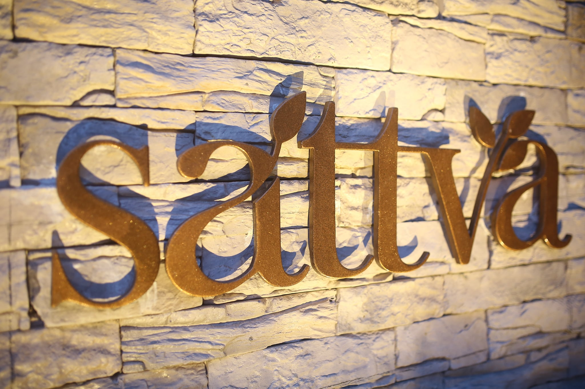

Satva.

Face: for many people like my bestie, theorem, friends, know, a mystery of how I chose such a place. This is not a lifetime achievement but definitely a life test. So writing... as part of length...

Nanganallur - Chennai's thanjavur, who understands that we should not live in the temple in the temple of the temple of the temple. When Chennai was drowned in the flood in 2015, it is believed that the 32 feet anjaneya was saved by the nanganjanev hills. In 1992, Kali's late mr. In the benefit of aramani, from the day when we built a house called " pleasure everything will climb up in our lives. After our Swami Associates Bun Branch, flight travel is essential from dance. Three minutes from nanganallur, Chennai airport. The moment when I cry on the airline staff of the airline staff final boarding, I will leave home and hit their age.

From the airport three minutes from the reservt forest border, from the "Satva" to leave the neighbors of the airport, to live with the neighbors, to live with the neighbors. No one ever thought we would migrate one day. But we named it.

Mr. In 2003 Panneer Selvam has become familiar with me. Even though he came to me to conduct a company Central Case, we had a strong friendship among us. Friend who respects friendship. In the country where a wonderful logic. I argued his case in tribunal and called Coimbatore to give him a treat. I came to Coimbatore on may 29th may 29th, saying that I am coming to court holly days. He made me pick-up at the airport and he left the car to the small vani falls in about 50 km from the airport. I don't understand anything. And when he came to the place, he took a plastic cake from his car and gave it to his driver and brought water from the spring. As soon as the driver went, he said, " jk, small water is the second sweetest water of Asia, that's why I asked him, " will this water come to Coimbatore He said, " coming. But whatever it may be, there will be no taste directly from the falls. This is the right respect for the beauty that you have argue and this 21 year single malt.... it was a little bit of it was a little bit.... mashed.

When I came from Chennai knife to Coimbatore, the feeling of aircooler all over the town. On the way to this falls, I realized that the weather has turned into a different way to the city of Allan. And when he bought the water that the driver had brought from the triveni sangam, and left him inside and left him alone, suddenly started a rain as a flower.

For me from a 42 degrees cooker, I said, " Paneer, let's get down for a minute That Year Southwest Monsoon was soon, the golden rain of Southwest Monsoon was drizzling. That Miracle happened when I looked at the opposite side.

The Nature of the young virgin of the young virgin appeared as a grand rainbow. It turned into sugarcane and became a deep into me. The moment when I had a drink, the seed fell into my heart, wherever my life journey started, wherever my life journey continues, the seed fell into my mind.

Then I said to him, "how would it be if a house of a house of kitty in this place and he broke the lady to my dream," it will be stupid

Will continue...